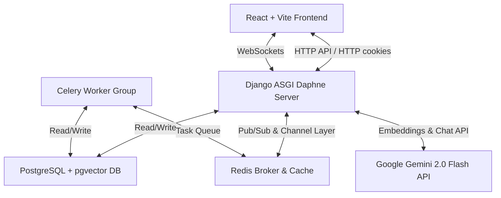
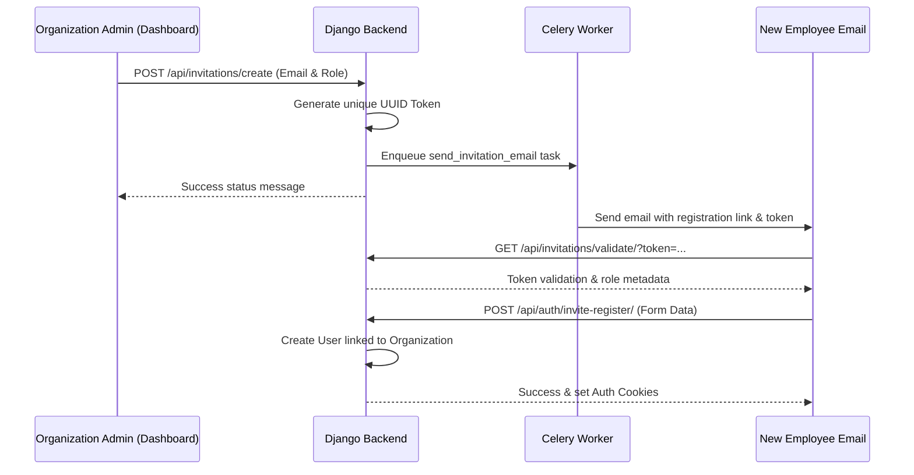
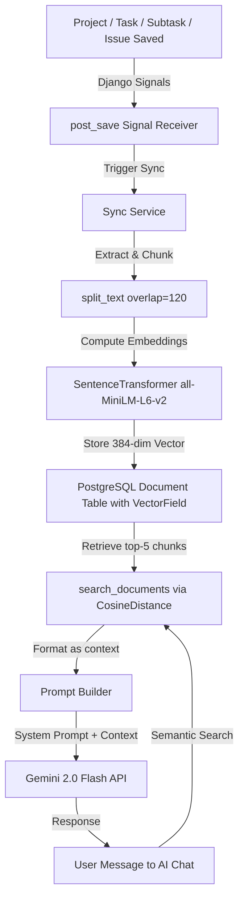

# ProjectFlow: Enterprise Project Management SaaS Documentation

ProjectFlow is a multi-tenant Software-as-a-Service (SaaS) Project Management and Productivity platform. It is engineered with a split-architecture featuring a React frontend, a Django REST framework backend with ASGI Channels for WebSockets, background tasks driven by Celery and Redis, and vector-search (RAG) powered by PostgreSQL (`pgvector`) and Gemini AI models.

---

## 1. System Architecture Overview

The application follows a micro-services style dockerized architecture:



### Key Services
1. **Frontend (React + Vite)**: A responsive client-side SPA. Features clean styling, state management, and WebSocket connections for real-time channels.
2. **Backend (Django ASGI via Daphne)**: Exposes a REST API via Django REST Framework (DRF) and manages real-time socket connections via Django Channels.
3. **Database (PostgreSQL + pgvector)**: Houses application data and performs semantic vector similarity matching on project items.
4. **Broker & Cache (Redis)**: Acts as the Django Channels layer backend, Celery task broker, and cache storage.
5. **Background Workers (Celery)**: Offloads asynchronous operations such as sending emails, calculating daily digests, generating weekly performance summaries, and compiling system backups.
6. **AI Layer (Gemini API & SentenceTransformers)**: Computes 384-dimensional text embeddings (`all-MiniLM-L6-v2`) and supplies semantic insight through Gemini 2.0 Flash.

---

## 2. Technology Stack & Containerization

### Tech Stack Details
- **Frontend**: React (v18), Vite, React Router DOM (v6), vanilla CSS, custom React contexts (Authentication, Real-time Alerts, Chat).
- **Backend**: Python (v3.11/3.12), Django (v5/6), Django REST Framework, Django Channels (ASGI), Daphne.
- **Database**: PostgreSQL (v16) with the `pgvector` extension.
- **Task Queue & Caching**: Redis (v7), Celery.
- **AI Integration**: `sentence-transformers` for embedding generation locally, `google-generativeai` API client for text generation.

### Docker Compose Services (`docker-compose.yml`)
- `backend`: Runs the Django application on port `8000` using Daphne: `daphne -b 0.0.0.0 -p 8000 management.asgi:application`.
- `frontend`: Exposes the Vite dev server on port `5173`.
- `db`: Launches the `pgvector/pgvector:pg16` database container on port `5432`.
- `redis`: Launches a Redis v7 container on port `6379`.
- `celery`: Spins up Celery workers running `celery -A management worker -l info`.

---

## 3. Multi-Tenancy & Role-Based Access Control (RBAC)

ProjectFlow is built as a multi-tenant application. Every user profile is linked to an `Organization`. Row-level filtering in the database ensures users can only access records matching their organization identifier.

### Roles Matrix

| Role | Target Portal | Description & Permissions |
| :--- | :--- | :--- |
| **Platform Admin** | Platform Portal (`/platform`) | Platform-wide super admin. Manages global organizations, alters subscription tiers, clears caches, views system logs, and creates system-wide backups. |
| **Admin** | Manager Portal (`/dashboard`) | Organization-level owner. Can send invitations, modify member roles, configure organization settings, and has full read/write access to all organization projects, tasks, issues, and calendar schedules. |
| **Manager** | Manager Portal (`/dashboard`) | Project leader. Can create projects, delegate tasks, supervise timelines, review workload metrics, check project health status, and generate AI insights. |
| **Employee** | Employee Workspace (`/workspace`) | Standard team member. Can view assigned work, update subtask statuses (todo, in progress, review, done), raise issues, record comments, submit leaves, and use the RAG AI chatbot. |

### Authentication & Socket Security
- **JWT Auth**: The application uses Cookie-based JWT tokens (`access_token` and `refresh_token` stored as HttpOnly, Secure, SameSite cookies).
- **Custom WS Middleware**: Real-time websocket endpoints are protected by `JWTAuthMiddleware` (defined in `backend/management/management/jwt_middleware.py`), which reads authorization tokens from client cookies during the WebSocket handshake to authorize connection parameters.

---

## 4. Core System Workflows

### 4.1 Onboarding & Organization Registration
1. An administrator visits `/signup` and submits organization name, full name, email, and password.
2. The endpoint `POST /api/organizations/register/` creates:
   - A new `Organization` instance.
   - An owner account (User profile with `role="admin"`).
3. The server sets JWT cookies, enabling immediate login redirecting to the `/dashboard`.

### 4.2 Invitation Flow

*Note: Admins can also upload a CSV list of emails to invite employees in bulk via `POST /api/invitations/bulk/`.*

### 4.3 Task Breakdown & Project Lifecycle
1. **Project Initiation**: A manager creates a project via `POST /api/projects/` (supplying priority, due date, description).
2. **Task Creation**: Within the project, the manager creates parent tasks.
3. **AI Task Breakdown**: The manager can query `POST /api/ai/task-breakdown/` to analyze a parent task description and output a hierarchy of subtasks.
4. **Work Assignment**: Subtasks are assigned to employees.
5. **Execution**: Employees update subtask status cards in their Workspace board.
6. **State Transitions**:
   - `todo` $\rightarrow$ `in_progress` $\rightarrow$ `review` $\rightarrow$ `done`.
   - Completion rate of subtasks automatically calculates parent task progress metrics.

### 4.4 Issue Raising and Triage Flow
1. **Report**: An employee encounters an issue and submits it via `POST /api/issues/` (specifying project, task, description, priority, and optional screenshots).
2. **Notification**: The manager gets an alert that an issue has been raised.
3. **Triage**: The manager changes the status to `investigating` and assigns it to an engineer.
4. **Resolution**: Once fixed, the engineer changes the status to `resolved` or `closed`.

### 4.5 Employee Leave Request Workflow
1. **Submission**: Employees submit a leave request via `POST /api/leave/requests/` (leave type: annual, sick, casual, unpaid, dates, description).
2. **Triage**: Managers receive a notification and review the request.
3. **Action**: Managers call `POST /api/leave/requests/<uuid:leave_id>/<action>/` (`approve` or `deny`).
4. **Balance Update**: Upon approval, the employee's `LeaveBalance` is decremented.

### 4.6 Real-Time Communication (Chat)
- **1-on-1 Chats**: Handled via `ws://<host>/ws/chat/<conversation_id>/`. Messages are broadcasted to participants instantly and stored in the database.
- **Group Channels**: Handled via `ws://<host>/ws/chat/group-channel/<channel_id>/`.
- **Live Notifications**: Triggers such as task assignments or issue comments emit to `ws://<host>/ws/notifications/` to update unread badges dynamically in the UI.

---

## 5. Background Tasks & Automations (Celery)

Celery background workers execute scheduled cron jobs and handle offloaded, slow-running processes.

### 1. `check_deadlines_and_remind` (Scheduled Worker)
- **Execution**: Runs periodically in the background.
- **Tasks**:
  - Scans active tasks and projects.
  - Sends system notifications if a due date is `3`, `1`, or `0` days away.
  - Sends a direct warning email if an employee's assigned subtask is due **tomorrow**.
  - Flags items as `is_overdue=True` if the deadline passes.

### 2. `send_daily_digest` (Daily Schedule)
- **Execution**: Once per day.
- **Tasks**:
  - Compiles pending tasks due today, overdue tasks/subtasks, upcoming milestones (next 3 days), and organizational events scheduled for the day.
  - Sends a single comprehensive digest notification to each active user.

### 3. `send_weekly_summary` (Weekly Schedule)
- **Execution**: Once per week.
- **Tasks**:
  - Counts tasks created/completed, issues resolved, leaves requested, and active project health states.
  - Emails or posts a summary performance report to admins and managers.

### 4. `send_invitation_email` (On-Demand Worker)
- Offloads email transmission during invitations to ensure rapid API response times.

---

## 6. Artificial Intelligence & RAG Engine

ProjectFlow has an integrated **Retrieval-Augmented Generation (RAG)** capability that syncs project data to vector embeddings, allowing users and managers to query a context-aware AI assistant.



### 6.1 Database Setup (`pgvector`)
- In `backend/management/knowledge_base/models.py`, documents are saved under a `Document` model:
  - `embedding`: `VectorField(dimensions=384)`
  - `source_type`: 'project', 'task', 'subtask', or 'issue'.
  - `source_id`: UUID format representation.
- Text representation of the entity is created containing headers (Project/Task name) and footers (Status/Priority).

### 6.2 Semantic Search
- Cosine Distance (`pgvector.django.CosineDistance`) queries the DB against calculated query embeddings.
- Filters out results exceeding a distance threshold of `0.50` and returns the top 5 relevant document chunks to inject into the LLM context.

### 6.3 Specialized AI Features Excluded from RAG Context
- **Project Summary**: Formats project health logs, completion stats, issues, and overloading counts to deliver summary briefings to managers.
- **Risk Detection**: Auto-detects overdue items, overloaded members, critical open bugs, and approaching project deadlines, alerting managers.
- **Task Breakdown**: Dynamically designs subtask lists. It attempts to call Gemini JSON mode; if API rate limits or network issues occur, it defaults to a local rule-based keyword match engine.
- **Workload Insights**: Generates capacity profiles, indicating balanced, underutilized, or overloaded employees.

---

## 7. Platform Administration Portal

Super administrators can access platform configuration fields directly through the `/platform` routing dashboard:

1. **System Health Metrics**: Real-time stats on active database size, cache objects, CPU/memory performance loads, and container lists.
2. **Organization Directory**: View registered tenants. Active controls allow toggling access (suspend/enable organizations) and switching subscriptions (e.g. Free, Growth, Enterprise).
3. **Session Controller**: Review list of active platform sessions.
4. **Maintenance Utilities**:
   - Clear Redis/Django caches immediately.
   - Live tail of server error logs.
   - Initiate manual database backup creation (creates a `.sql` bundle in `backups/`).

---

## 8. Complete API Endpoint Reference

Detailed backend routing table mapping:

### Authentication & Profiles (`/api/auth/`)
- `POST /api/auth/login/`: Logs in user, sets JWT cookies, returns profile.
- `POST /api/auth/logout/`: Clears JWT cookies.
- `POST /api/auth/refresh/`: Refreshes access token cookie.
- `GET /api/auth/me/`: Returns current logged-in user profiles.
- `PATCH /api/auth/profile/`: Updates current user profile details.
- `POST /api/auth/invite-register/`: Creates a user from an invitation token.

### Organizations (`/api/organizations/`)
- `POST /api/organizations/register/`: Registers new organization + admin account.
- `GET /api/organizations/team/`: Lists all organization users and active invites.

### Team Invitations (`/api/invitations/`)
- `POST /api/invitations/create/`: Sends an invitation token to a single email.
- `POST /api/invitations/bulk/`: Bulk processes invitations via a uploaded CSV file.
- `GET /api/invitations/validate/?token=...`: Validates a token and returns metadata.
- `POST /api/invitations/resend/{invitation_id}/`: Resends email.
- `DELETE /api/invitations/cancel/{invitation_id}/`: Cancels invitation.
- `DELETE /api/invitations/remove-member/{user_id}/`: Deletes membership.
- `POST /api/invitations/change-role/{user_id}/`: Alters user roles (manager, employee, admin).

### Projects & Milestones (`/api/projects/`)
- `GET /api/projects/`: Lists organization-wide projects.
- `POST /api/projects/`: Creates a new project.
- `GET /api/projects/{project_id}/`: Returns single project data.
- `PATCH /api/projects/{project_id}/`: Updates project configurations.
- `DELETE /api/projects/{project_id}/`: Deletes project files.
- `POST /api/projects/{project_id}/members/`: Adds project team members.
- `DELETE /api/projects/{project_id}/members/`: Removes project team members.

### Tasks, Subtasks & Comments (`/api/tasks/`)
- `GET /api/tasks/project/{project_id}/`: Lists project tasks.
- `POST /api/tasks/project/{project_id}/`: Creates a project task.
- `PATCH /api/tasks/task/{task_id}/`: Updates task details.
- `GET /api/tasks/task-detail/{task_id}/`: Returns details + comments.
- `GET /api/tasks/subtasks/{task_id}/`: Lists subtasks of task.
- `POST /api/tasks/subtasks/{task_id}/`: Adds a subtask.
- `PATCH /api/tasks/subtask/{subtask_id}/`: Updates a subtask.
- `DELETE /api/tasks/subtask/{subtask_id}/`: Deletes a subtask.
- `GET /api/tasks/comments/{task_id}/`: Lists task comments.
- `POST /api/tasks/comments/{task_id}/`: Adds a task comment.
- `GET /api/tasks/{task_id}/attachments/`: Lists task attachments.
- `POST /api/tasks/{task_id}/attachments/upload/`: Uploads task attachment.
- `DELETE /api/tasks/attachments/{attachment_id}/delete/`: Deletes task attachment.

### Workspace Actions (`/api/workspace/`)
- `GET /api/workspace/dashboard/`: Returns employee home analytics dashboard.
- `GET /api/workspace/my-tasks/`: Lists lightweight task cards for assigned work.
- `GET /api/workspace/tasks/`: Lists detailed assigned tasks.
- `GET /api/workspace/subtasks/`: Lists assigned subtasks.
- `GET /api/workspace/subtasks/{subtask_id}/`: Detailed subtask workspace info.
- `PATCH /api/workspace/subtasks/{subtask_id}/`: Updates status parameters.
- `GET /api/workspace/task/{task_id}/`: Large data payload for task view.
- `GET /api/workspace/activity-feed/`: Retrieves recent organization activities feed.

### Issues (`/api/issues/`)
- `GET /api/issues/`: Lists organization issues.
- `POST /api/issues/`: Submits a new issue with attachments.
- `PATCH /api/issues/{issue_id}/`: Triages or updates issues.

### Chat & Live Channels (`/api/chat/`)
- `GET /api/chat/`: Lists active chat conversations.
- `POST /api/chat/start/`: Starts a new peer-to-peer chat room.
- `GET /api/chat/{conversation_id}/messages/`: Gets conversation logs.
- `POST /api/chat/{conversation_id}/send/`: Broadcasts a chat message.
- `GET /api/chat/users/`: Lists users available to initiate chats.

### Calendar & Leaves (`/api/calendar/` and `/api/leave/`)
- `GET /api/calendar/events/`: Lists events.
- `POST /api/calendar/events/`: Adds a calendar event.
- `GET /api/calendar/feed/`: Formatted organizational events feed.
- `GET /api/leave/requests/`: Lists leave requests.
- `POST /api/leave/requests/`: Submits a leave request.
- `POST /api/leave/requests/{leave_id}/{action}/`: Approves or denies leave.
- `GET /api/leave/balances/`: Checks leave balance list.

### Artificial Intelligence (`/api/ai/`)
- `GET /api/ai/project-summary/{project_id}/`: Generates AI project summaries.
- `GET /api/ai/risk-detection/`: Scans for organization delivery risks.
- `POST /api/ai/task-breakdown/`: Generates subtasks for a task layout.
- `GET /api/ai/weekly-summary/`: Generates weekly performance metrics.
- `GET /api/ai/workload-insights/`: Retrieves workload insight reports.
- `POST /api/ai/chat/`: Queries RAG knowledge base via chatbot.

### Platform Super Admin (`/api/platform/`)
- `GET /api/platform/stats/`: Super-admin global database/system stats.
- `GET /api/platform/organizations/`: Registers organizations.
- `GET /api/platform/organizations/{org_id}/`: Returns tenant info.
- `POST /api/platform/organizations/{org_id}/toggle/`: Suspends/activates organization.
- `POST /api/platform/organizations/{org_id}/tier/`: Alters organization subscription tiers.
- `GET /api/platform/sessions/`: Returns active platform user list.
- `POST /api/platform/cache/clear/`: Flushes cached data.
- `GET /api/platform/logs/`: Returns server logger files.
- `POST /api/platform/backup/`: Triggers database SQL backups.
- `GET /api/platform/users/`: Lists all users registered on the application.

---

## 9. Setup & Local Execution Guide

### Prerequisites
- Docker & Docker Compose
- Or, local installations of: Python 3.11+, Node.js 18+, PostgreSQL with `pgvector`, Redis Server.

### Running with Docker (Recommended)
1. Configure env files:
   - Create `backend/management/.env` and copy necessary configuration keys (e.g. `SECRET_KEY`, `POSTGRES_DB`, `GEMINI_API_KEY`).
   - Create `frontend/.env` specifying backend API target (`VITE_API_URL=http://localhost:8000`).
2. Launch the dockerized suite:
   ```bash
   docker-compose up --build
   ```
3. Initialize the database:
   ```bash
   docker-compose exec backend python manage.py migrate
   docker-compose exec backend python manage.py createsuperuser
   ```

### Running Locally (Without Docker)
1. **Database Setup**: Ensure PostgreSQL has the `pgvector` extension installed (`CREATE EXTENSION vector;`).
2. **Start Redis**: Launch redis-server locally on port `6379`.
3. **Start Django Backend**:
   ```bash
   cd backend/management
   python -m venv venv
   source venv/Scripts/activate  # Windows
   pip install -r requirements.txt
   python manage.py migrate
   python manage.py runserver
   ```
4. **Start Celery Worker**:
   ```bash
   cd backend/management
   source venv/Scripts/activate
   celery -A management worker -l info
   ```
5. **Start Frontend Client**:
   ```bash
   cd frontend
   npm install
   npm run dev
   ```
